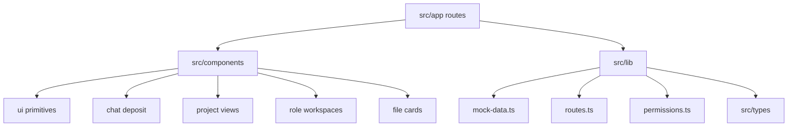

# App Architecture

La V1.5 est une application Next.js App Router statique. Les donnees viennent de `src/lib/mock-data.ts`. Les pages restent des Server Components sauf composants interactifs existants.

## Structure

```txt
src/
  app/          routes Next.js
  components/   UI, layout, marketing, chat, project, files, roles
  lib/          mock data, routes, permissions, utils
  types/        types metier partages
docs/           documentation produit et architecture
```



## Contraintes

- Aucun secret dans le code.
- Aucun vrai fichier sensible dans `public/`.
- Aucune promesse de securite serveur en V1.
- Toute future action serveur devra refaire les controles de permissions.
