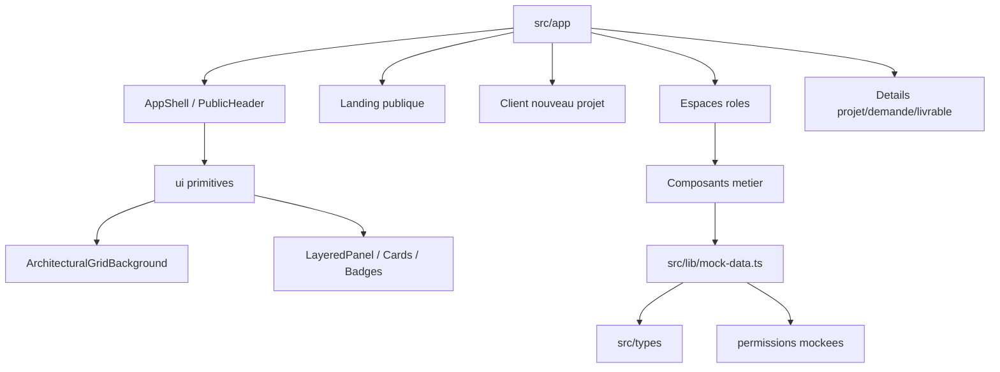

# App Architecture

La V1.5 est une application Next.js App Router statique. Les donnees viennent de `src/lib/mock-data.ts`. Les routes et composants restent principalement des Server Components.

## Structure

```txt
src/
  app/          routes Next.js
  components/   ui, layout, marketing, chat, project, files, roles, dashboard
  lib/          mock-data, routes, permissions, utils
  types/        modeles metier partages
docs/           vision produit, UX/UI, architecture, workflows
```



## Contraintes

- Aucun secret dans le code.
- Aucun vrai fichier sensible dans `public/`.
- Aucune promesse de securite serveur en V1.
- Toute action serveur future devra refaire les controles de permissions.
