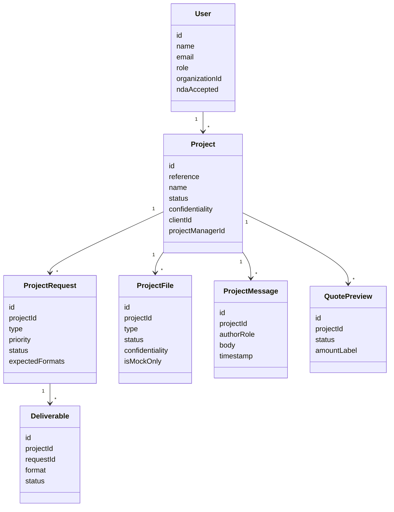

# Data Model

Le modele V1.5 est mocke. Il sert a preparer les objets V2.

```mermaid
classDiagram
  class User {
    id
    name
    email
    role
    organizationId
    ndaAccepted
  }
  class Project {
    id
    reference
    name
    status
    confidentiality
    clientId
    projectManagerId
  }
  class ProjectRequest {
    id
    projectId
    type
    priority
    status
    expectedFormats
  }
  class ProjectFile {
    id
    projectId
    type
    status
    confidentiality
    isMockOnly
  }
  class ProjectMessage {
    id
    projectId
    authorRole
    body
    timestamp
  }
  class Deliverable {
    id
    projectId
    requestId
    format
    status
  }
  class QuotePreview {
    id
    projectId
    status
    amountLabel
  }
  User "1" --> "*" Project
  Project "1" --> "*" ProjectRequest
  Project "1" --> "*" ProjectFile
  Project "1" --> "*" ProjectMessage
  ProjectRequest "1" --> "*" Deliverable
  Project "1" --> "*" QuotePreview
```
