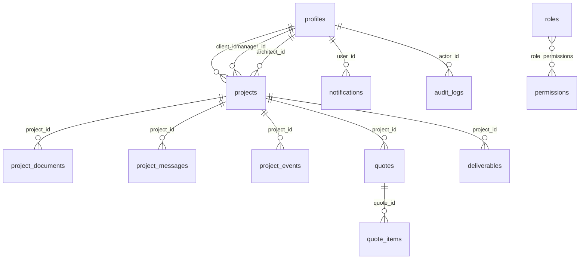

# Data model — PlanWork

Postgres (Supabase) — see `supabase/migrations/0001_init_schema.sql` for the
authoritative DDL. This document is a human summary.

## Entities



## Tables

| Table                | Rôle                                          |
| -------------------- | --------------------------------------------- |
| `profiles`           | 1 ligne par `auth.users` — rôle, état, infos  |
| `roles`              | Catalogue des rôles applicatifs               |
| `permissions`        | Catalogue des permissions (clés stables)      |
| `role_permissions`   | Affectation N×N rôle ↔ permission             |
| `projects`           | Demande client → workflow                     |
| `project_documents`  | Fichiers déposés (PDF, DWG, croquis…)         |
| `project_messages`   | Conversation projet                           |
| `project_events`     | Timeline projet                               |
| `quotes`             | Devis manager → client                        |
| `quote_items`        | Lignes de devis                               |
| `deliverables`       | Livrables architectes                         |
| `notifications`      | File de notifications par utilisateur         |
| `audit_logs`         | Trace des actions sensibles                   |
| `app_policies`       | Politiques applicatives (GPO front)           |

## Enums

```sql
app_role               -- client | architect | manager | admin
project_status         -- draft | intake | qualified | assigned | in_progress | review | delivered | archived | cancelled
project_priority       -- low | normal | high | urgent
project_confidentiality-- standard | nda_required | restricted
project_message_kind   -- message | system | status_change | assignment | quote | file
quote_status           -- draft | sent | accepted | refused | expired
deliverable_status     -- draft | review | published | archived
```

## Triggers

| Trigger                       | Effet                                                   |
| ----------------------------- | ------------------------------------------------------- |
| `handle_new_user`             | Sur `auth.users INSERT`, crée la ligne `profiles`       |
| `projects_set_reference`      | Génère `PRJ-YYYYMM-XXXX` avant insert si vide           |
| `*_set_updated_at`            | Maintient `updated_at` sur `profiles/projects/quotes/deliverables` |

## Fonctions

```sql
current_role() returns app_role
is_admin() returns boolean
is_manager_or_admin() returns boolean
can_access_project(uuid) returns boolean
```

Utilisées massivement dans les policies RLS — voir `docs/security-rls.md`.

## Reference legacy

Les anciens types `src/types/{project,user,…}.ts` sont conservés pour les
écrans `dashboard/*` historiques basés sur mocks. Ils ne sont **plus** la
source de vérité — utiliser `src/types/database.ts` pour tout nouveau code.
