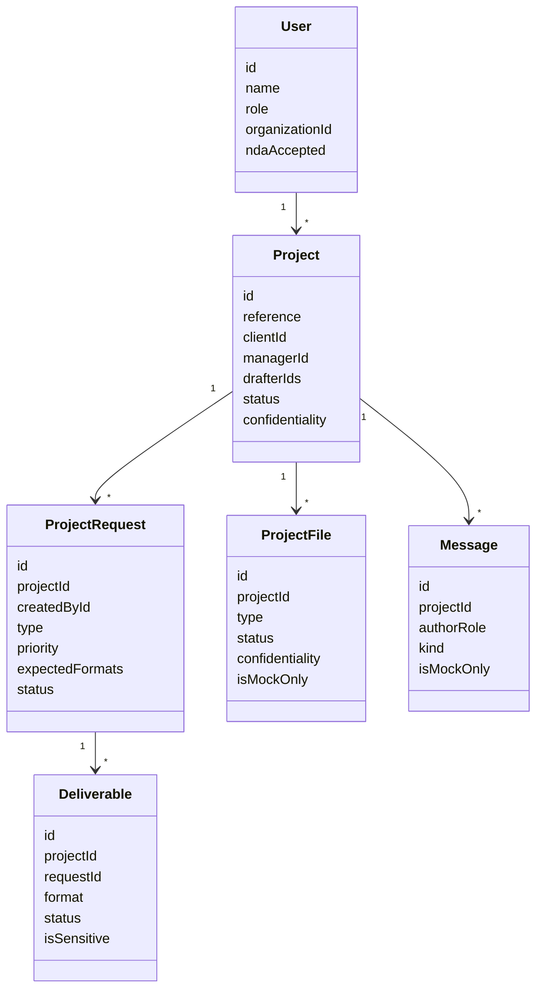

# Data Model

Le modele V1.5 est fictif, stocke dans `src/lib/mock-data.ts`. Il prepare les objets necessaires a la V2 sans stockage reel.

## Notes V2

- Ajouter base de donnees.
- Ajouter stockage prive.
- Relier chaque fichier a un projet, une organisation, un role et un journal d'acces.
- Refuser toute exposition client sans controle serveur.
