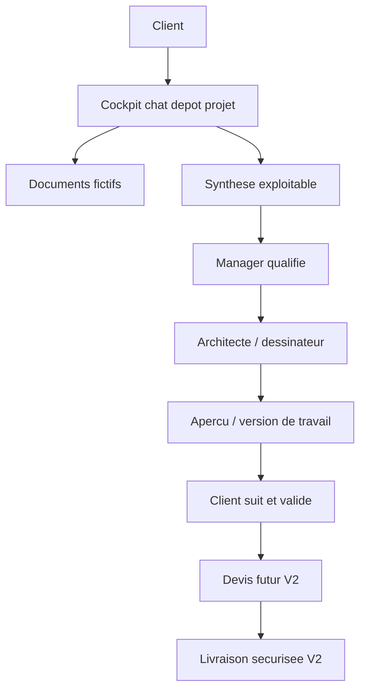

# Product Vision

Vellum est une plateforme B2B pour deposer, cadrer, suivre et piloter des demandes liees a des plans techniques : DWG, PDF, croquis, schemas electriques, plomberie, photos de site, notes projet, corrections et livrables.

La V1.5 reste une demonstration front statique. Elle sert a vendre la vision produit : un client depose un projet dans un cockpit/chat pleine page, l'equipe qualifie, un architecte ou dessinateur travaille, puis le client suit l'avancement.

## Promesse

- Remplacer les demandes dispersees par un dossier projet clair.
- Structurer le besoin client avant production.
- Donner a chaque role une vue adaptee : client, manager, architecte, admin.
- Preparer une V2 avec comptes, stockage prive, permissions serveur, NDA et audit.

## Limites V1.5

- Pas de backend.
- Pas d'authentification reelle.
- Pas d'API.
- Pas d'upload reel.
- Pas de base de donnees.
- Pas de paiement.
- Pas de securite serveur active.

## V1.5 actuelle

La V1.5 montre maintenant le produit comme un workflow complet :

- capture client Lazy-inspired pour transformer un besoin libre en demande structuree ;
- cockpit client pour voir projets, actions, messages, devis et livrables ;
- console manager pour qualifier, assigner et preparer un devis mocke ;
- atelier architecte / dessinateur pour analyser, questionner et preparer un apercu ;
- viewer document mocke pour illustrer calques, annotations et validation ;
- centre admin pour gouvernance, roles, activite et securite V2 a construire.

Le demo role switcher et la command palette servent uniquement a presenter le parcours plus vite. Ils ne remplacent pas une authentification.

