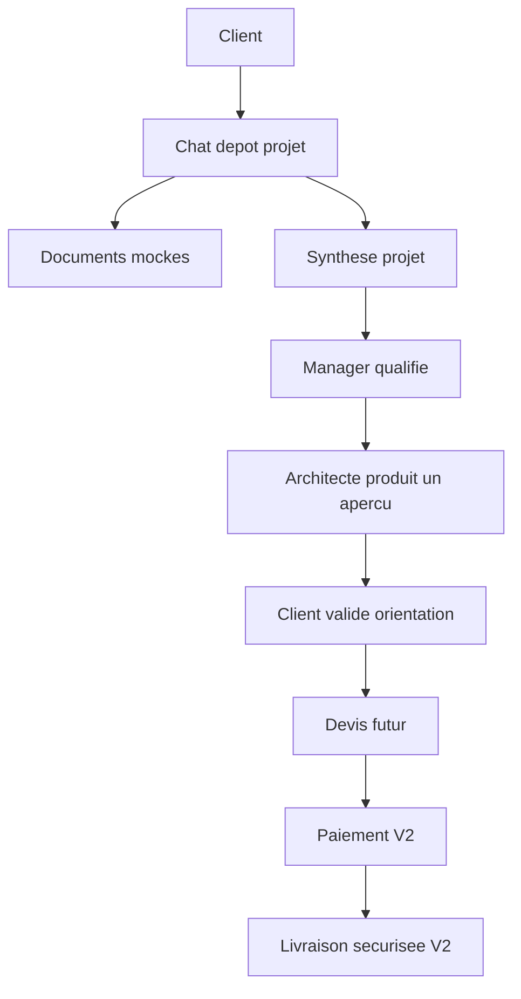

# Product Vision

PlanWork est une plateforme B2B pour cadrer, suivre et piloter des projets lies a des plans techniques, documents projet et livrables.

La V1.5 reste une demonstration front statique. Elle doit permettre a un associe, mentor ou client de comprendre rapidement la promesse produit : un client depose un projet dans un chat plein ecran, prepare ses documents, puis l'equipe qualifie, assigne et suit la production.

## Promesse

- Centraliser les demandes qui arrivent aujourd'hui par email, message ou fichier joint.
- Transformer un besoin flou en dossier projet lisible.
- Prepararer la future securite serveur autour des roles, projets, documents et NDA.
- Donner une vision claire des espaces client, manager, architecte et admin.

## Limites V1.5

- Pas de backend.
- Pas d'authentification reelle.
- Pas d'API.
- Pas d'upload reel.
- Pas de base de donnees.
- Pas de paiement.
- Pas de securite serveur active.

