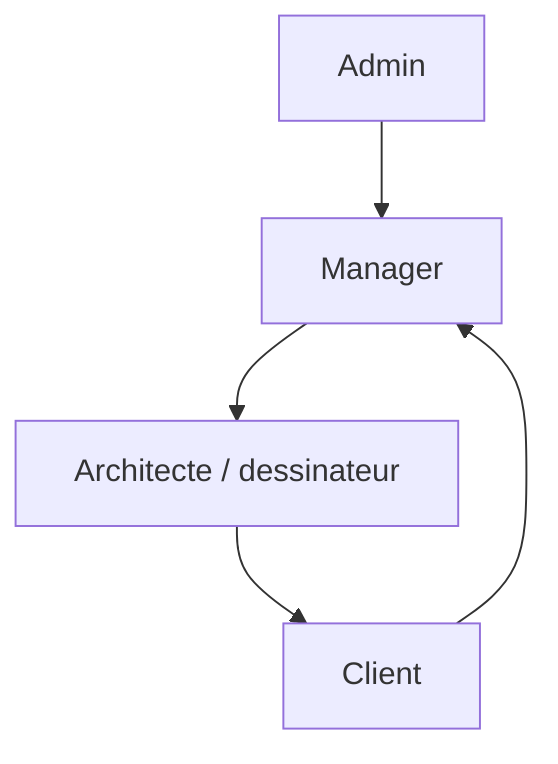
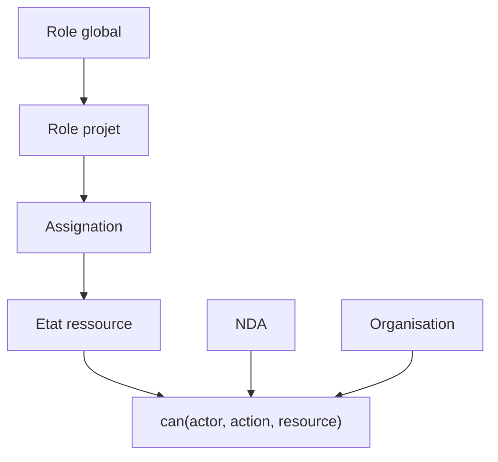

# Roles And Permissions

La V1.5 affiche un modele cible. Elle ne securise rien cote serveur.

## Roles

- Client : depose un projet, suit ses projets, repond aux questions.
- Manager : qualifie, assigne, prepare le devis.
- Architecte : produit, pose des questions, transmet un apercu.
- Admin : gouvernance, roles, activite, configuration future.

## Actions futures

| Role | Projet | Documents | Messages | Devis |
| --- | --- | --- | --- | --- |
| Client | Ses projets | Fichiers autorises | Lire/repondre | Voir apres validation |
| Manager | Projets assignes | Qualifier | Coordonner | Preparer |
| Architecte | Projets assignes | Lire selon droits | Poser questions | Non |
| Admin | Gouvernance | Selon politique | Audit | Configurer |
