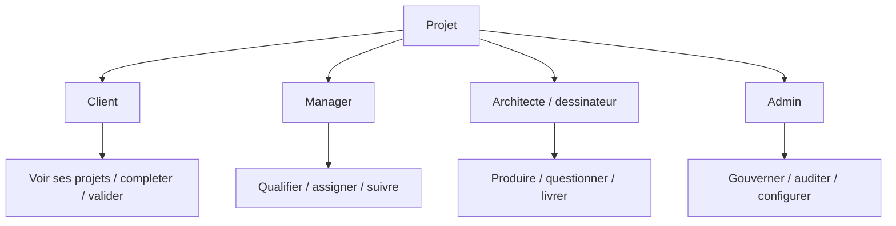
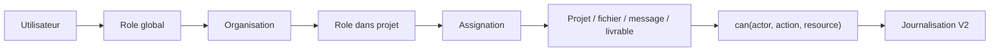

# Roles And Permissions

La V1.5 affiche une matrice de permissions cible. Elle ne securise rien cote serveur. Les restrictions UI sont seulement pedagogiques.

## Roles

- Client : depose un projet, suit ses dossiers, repond aux questions, valide un apercu futur.
- Manager : qualifie, priorise, assigne, prepare devis et validation.
- Architecte / dessinateur : analyse documents, pose questions, prepare apercus et livrables.
- Admin : gouvernance, roles, permissions, activite et configuration future.

## Modele cible

## Regle non negociable

Toute action sensible devra etre verifiee cote serveur en V2 : lecture fichier, upload, telechargement, message, livrable, devis, paiement et administration.
