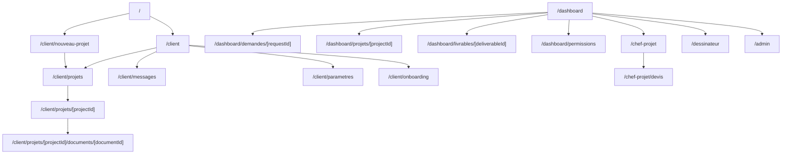
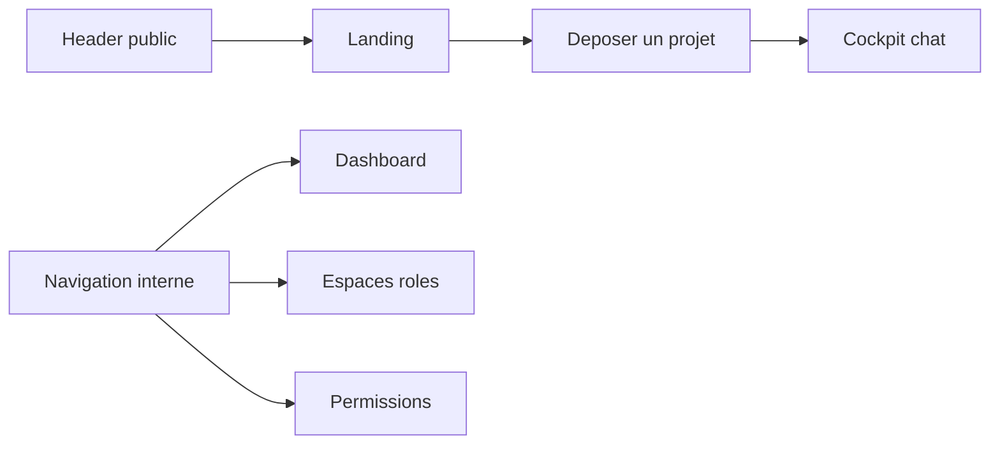

# Routes Map

## Routes principales

- `/` : landing publique premium.
- `/client` : portail client.
- `/client/nouveau-projet` : cockpit chat de depot projet.
- `/client/onboarding` : parcours client mocke avant premier depot.
- `/client/messages` : inbox projet mockee.
- `/client/parametres` : parametres client simules.
- `/client/projets` : liste des projets client.
- `/client/projets/[projectId]` : detail projet cote client.
- `/client/projets/[projectId]/documents/[documentId]` : viewer document mocke.
- `/dashboard` : command center global mocke.
- `/dashboard/demandes/nouvelle` : alias du parcours nouveau projet.
- `/dashboard/demandes/[requestId]` : detail demande.
- `/dashboard/projets/[projectId]` : detail projet.
- `/dashboard/livrables/[deliverableId]` : detail livrable.
- `/dashboard/permissions` : matrice de permissions cible.
- `/chef-projet` : console manager de qualification et assignation.
- `/chef-projet/devis` : constructeur de devis mocke.
- `/dessinateur` : atelier architecte / dessinateur.
- `/admin` : control center admin mocke.

