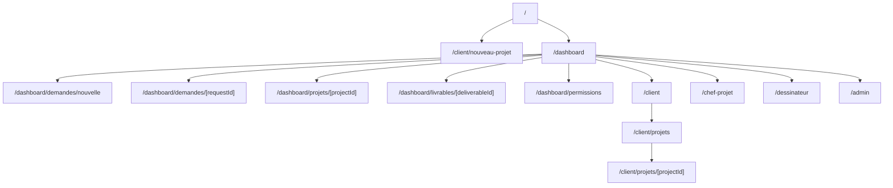
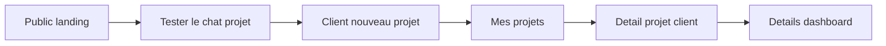

# Routes Map

## Routes principales

- `/` : landing publique.
- `/dashboard` : pilotage global mocke.
- `/dashboard/demandes/nouvelle` : chat depot projet.
- `/dashboard/demandes/[requestId]` : detail demande.
- `/dashboard/projets/[projectId]` : detail projet.
- `/dashboard/livrables/[deliverableId]` : detail livrable.
- `/dashboard/permissions` : matrice permissions.
- `/client` : espace client.
- `/client/nouveau-projet` : nouveau projet via chat.
- `/client/projets` : projets client.
- `/client/projets/[projectId]` : detail projet client.
- `/chef-projet` : espace manager.
- `/dessinateur` : espace architecte.
- `/admin` : espace admin.

