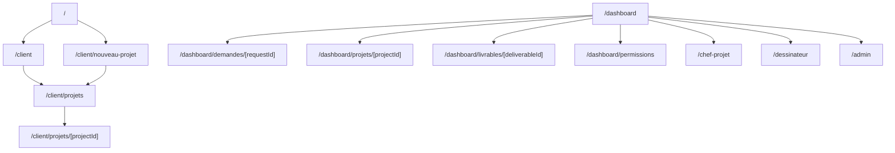
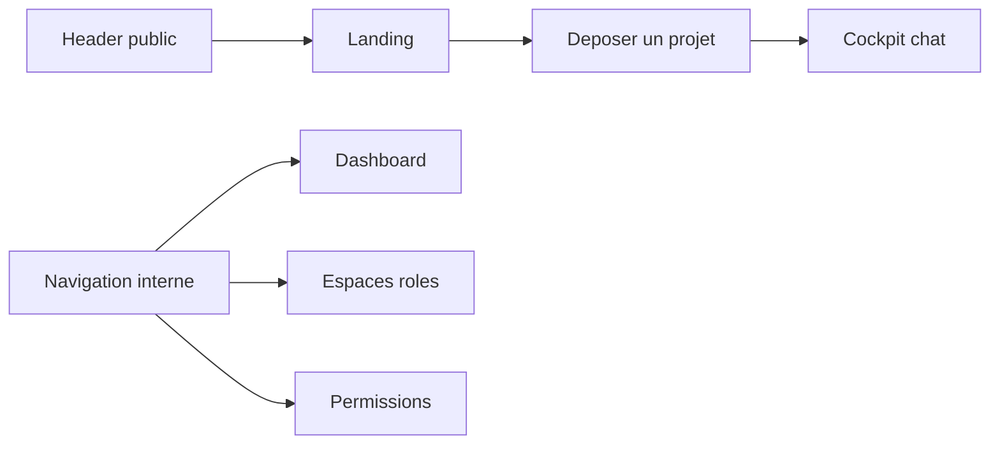

# Routes Map

## Routes principales

- `/` : landing publique premium.
- `/client` : portail client.
- `/client/nouveau-projet` : cockpit chat de depot projet.
- `/client/projets` : liste des projets client.
- `/client/projets/[projectId]` : detail projet cote client.
- `/dashboard` : command center global mocke.
- `/dashboard/demandes/nouvelle` : alias du parcours nouveau projet.
- `/dashboard/demandes/[requestId]` : detail demande.
- `/dashboard/projets/[projectId]` : detail projet.
- `/dashboard/livrables/[deliverableId]` : detail livrable.
- `/dashboard/permissions` : matrice de permissions cible.
- `/chef-projet`, `/dessinateur`, `/admin` : espaces role.

