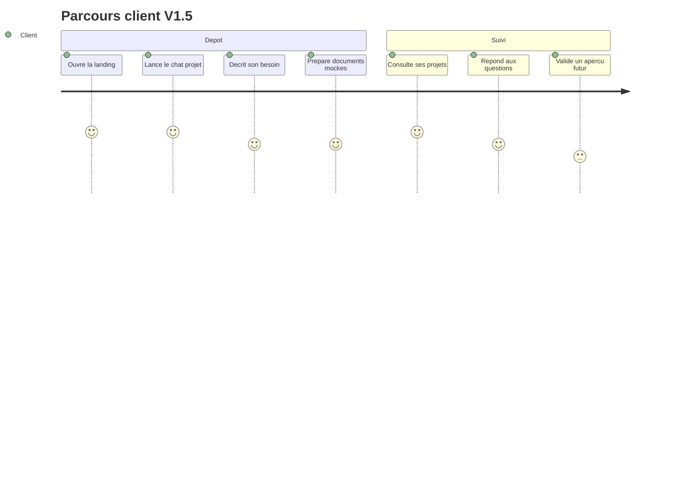
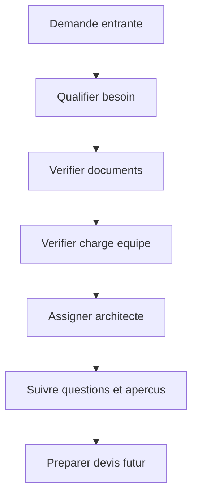
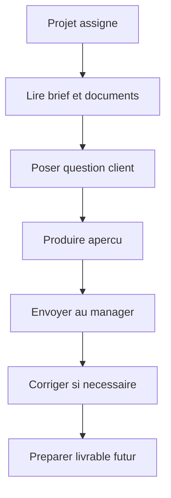

# User Flows

## Parcours client

```mermaid
journey
  title Parcours client V1.5
  section Depot
    Ouvre la landing: 5: Client
    Lance le chat projet: 5: Client
    Decrit son besoin: 4: Client
    Prepare documents mockes: 4: Client
  section Suivi
    Consulte ses projets: 5: Client
    Repond aux questions: 4: Client
    Valide un apercu futur: 3: Client
```

## Parcours manager

```mermaid
flowchart TD
  Intake["Demande entrante"] --> Qualify["Qualifier besoin"]
  Qualify --> CheckDocs["Verifier documents"]
  CheckDocs --> Capacity["Verifier charge equipe"]
  Capacity --> Assign["Assigner architecte"]
  Assign --> Follow["Suivre questions et apercus"]
  Follow --> Quote["Preparer devis futur"]
```

## Parcours architecte

```mermaid
flowchart TD
  Assigned["Projet assigne"] --> ReadBrief["Lire brief et documents"]
  ReadBrief --> Ask["Poser question client"]
  Ask --> Produce["Produire apercu"]
  Produce --> Review["Envoyer au manager"]
  Review --> Iterate["Corriger si necessaire"]
  Iterate --> Deliver["Preparer livrable futur"]
```
