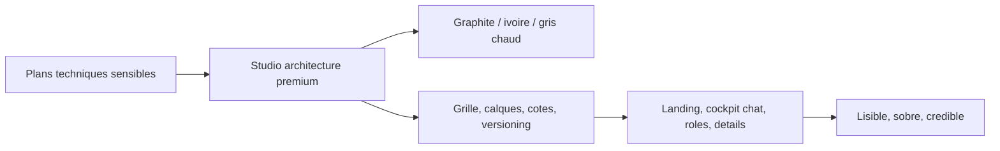

# UX UI Pro Max Direction

Direction retenue : rupture avec le SaaS bleu classique. La V1.5 adopte une identite "architectural future UI" : studio d'architecture premium, table de dessin numerique, cockpit projet et documents confidentiels.

Mise a jour landing : le premier ecran doit maintenant viser une sensation plus cinematic product, inspiree des codes Umbrel / Godly sans copie directe : header flottant en pilule, fond graphite profond, grand mockup produit, chat projet visible et documents techniques en flottement.

## Principes UI

- Base graphite, noir profond, blanc casse et gris chaud.
- Accents limites : ivoire, argent, vert statut, ambre alerte.
- Bleu autorise uniquement en micro-accent technique, jamais dominant.
- Grille architecturale subtile, traits fins, panneaux calques.
- Une action principale par ecran.
- Pas de fausse promesse : V1 front mockee, securite serveur en V2.
- Mobile-first : pas de debordement horizontal, CTA visibles, chat utilisable.

## Systeme visuel

- Surfaces : `#171613`, `#f4f1ea`, `#fbfaf6`.
- Bordures : fines, chaudes, proches papier/calque.
- Rayon : 3 a 6px dans l'app metier ; grands rayons et pilules autorises sur la landing publique pour renforcer le rendu Apple / Tesla.
- Ombres : faibles, profondes, sans effet gadget.
- Icones : lucide, lineaires, coherentes.

## Landing cinematic

- Header public fixe, centre, en pilule noire avec blur leger.
- Hero sombre quasi plein ecran avec contraste fort et tres peu de couleurs.
- Mockup produit a droite : cockpit, chat projet, pieces jointes fictives, statut, synthese.
- Documents flottants sobres : DWG, PDF annote, schema electrique, croquis.
- Bleu SaaS interdit dans le premier ecran ; accents limites a ivoire, ambre doux et vert statut.
- Les sections suivantes restent harmonisees avec la DA, sans rupture entre hero et page.

## Intake Lazy-inspired

- `/client/nouveau-projet` devient le moment produit principal : ecran sombre immersif, capture box large, halo horizontal discret, documents fictifs et synthese immediate.
- La saisie doit ressembler a une conversation avec un expert, pas a un formulaire CRM.
- Les chips documents restent lisibles et sobres : DWG, PDF, croquis, schema electrique, schema plomberie, photo, note, correction, livrable attendu.
- La transition d'envoi montre une qualification mockee : analyse, structuration, transmission manager, creation projet, ouverture cockpit.
- Mention obligatoire : aucun fichier reel n'est envoye en V1.

## Workflow app

- Client : cockpit simple avec action principale "Deposer un projet", actions attendues, messages et livrables a valider.
- Manager : console dense type Linear/Raycast, demandes entrantes, inspector projet, capacite equipe et devis mocke.
- Architecte : atelier de production, documents a analyser, checklist, questions client, apercus et planning.
- Admin : gouvernance serieuse, roles, permissions, activite, sante plateforme et securite V2 a prevoir.
- Les micro-interactions doivent confirmer une action et clarifier la prochaine etape, jamais decorer gratuitement.

