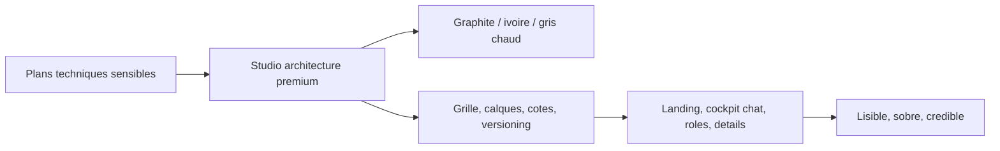

# UX UI Pro Max Direction

Direction retenue : rupture avec le SaaS bleu classique. La V1.5 adopte une identite "architectural future UI" : studio d'architecture premium, table de dessin numerique, cockpit projet et documents confidentiels.

## Principes UI

- Base graphite, noir profond, blanc casse et gris chaud.
- Accents limites : ivoire, argent, vert statut, ambre alerte.
- Bleu autorise uniquement en micro-accent technique, jamais dominant.
- Grille architecturale subtile, traits fins, panneaux calques.
- Une action principale par ecran.
- Pas de fausse promesse : V1 front mockee, securite serveur en V2.
- Mobile-first : pas de debordement horizontal, CTA visibles, chat utilisable.

## Systeme visuel

- Surfaces : `#171613`, `#f4f1ea`, `#fbfaf6`.
- Bordures : fines, chaudes, proches papier/calque.
- Rayon : 3 a 6px pour une sensation precise, pas "startup rounded".
- Ombres : faibles, profondes, sans effet gadget.
- Icones : lucide, lineaires, coherentes.

