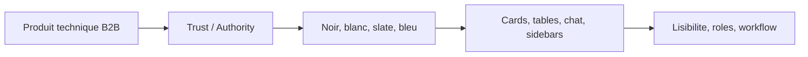

# UX UI Pro Max Direction

Direction retenue : SaaS B2B premium, trust and authority, dense mais lisible, inspire interfaces Apple, Linear, Vercel et outils de gestion de projets techniques.

## Principes UI

- Une action principale par ecran.
- Contraste fort, texte lisible, cartes sobres.
- Grille technique subtile, jamais decorative au point de nuire a la lecture.
- Micro-interactions courtes, sans effet gadget.
- Mobile-first : pas de debordement horizontal.
- Couleur fonctionnelle avec texte explicite, jamais couleur seule.

## Systeme visuel

- Fond : blanc, slate, noir profond.
- Accent principal : bleu technique.
- Etats : vert pour validation, ambre pour attente, rouge pour urgence.
- Rayon : cartes sobres, 8px environ.
- Icones : lucide uniquement, style coherent.

