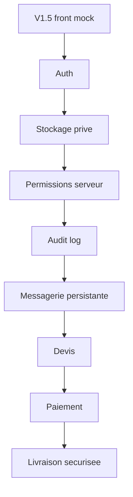

# V2 Roadmap

La V2 devra transformer la demonstration en produit exploitable.

## Modules prioritaires

1. Authentification et comptes.
2. Organisations et roles projet.
3. Stockage prive des documents.
4. Upload securise avec antivirus/metadonnees.
5. Permissions serveur centralisees.
6. Journal d'audit.
7. Messagerie persistante.
8. Devis et paiement.
9. Livraison securisee des livrables.
10. Notifications.

## Regle de securite

Aucun fichier reel ne doit etre accepte avant que stockage prive, permissions serveur et audit ne soient operationnels.
