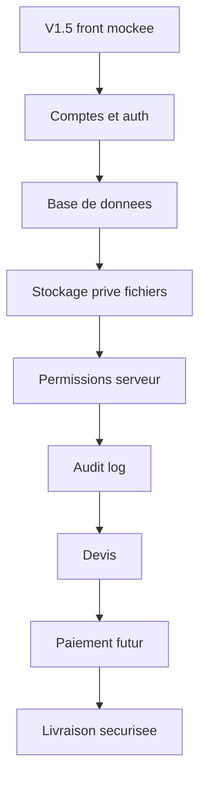

# V2 Roadmap

La V2 doit transformer la demonstration front en produit exploitable, sans sacrifier la confidentialite des fichiers techniques.

## Modules prioritaires

1. Authentification et organisations.
2. Modele projets/demandes/messages/livrables.
3. Stockage fichiers prive avec URLs non publiques.
4. Permissions serveur via `can(actor, action, resource)`.
5. Journal d'audit.
6. Workflow manager -> architecte -> client.
7. Devis puis paiement plus tard.
