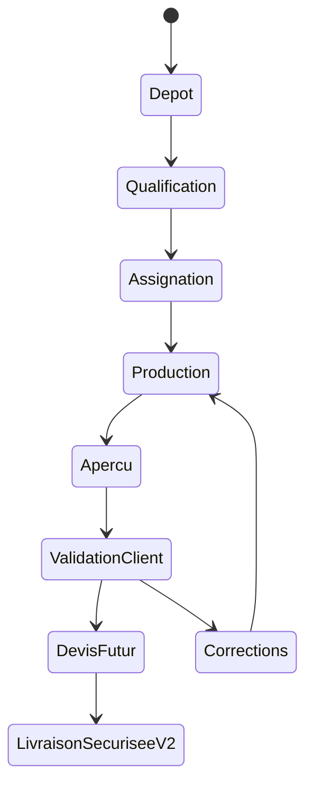
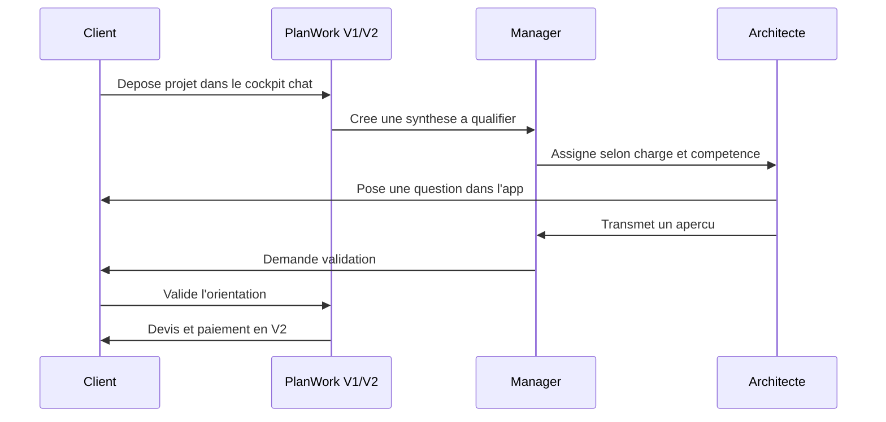
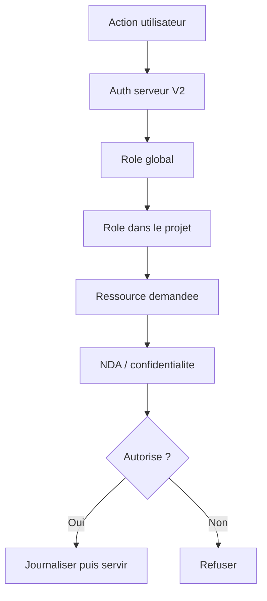

# Workflow

## Cycle de vie projet

## Sequence cible

## Statuts V1.5 representes

- Brouillon : le client prepare le brief.
- Envoye : la demande est transmise a l'equipe en simulation.
- A qualifier : le manager doit verifier scope, formats et priorite.
- En analyse manager : l'equipe clarifie le cadrage.
- Assigne : un architecte / dessinateur prend le relais.
- En production : les documents sont analyses et un apercu est prepare.
- Question client : une precision est attendue.
- Apercu transmis : le client peut valider ou demander correction.
- Devis a valider : devis mocke, paiement prevu en V2.
- Paiement futur : etape visible mais inactive.
- Livrables prets : livraison finale prevue dans un espace securise V2.

La source de verite front est `src/lib/workflow.ts`. Elle decrit le label, le responsable, la prochaine action et la tonalite visuelle de chaque statut.

## Permissions cible

