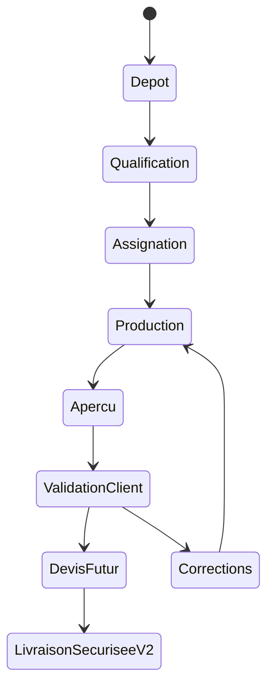
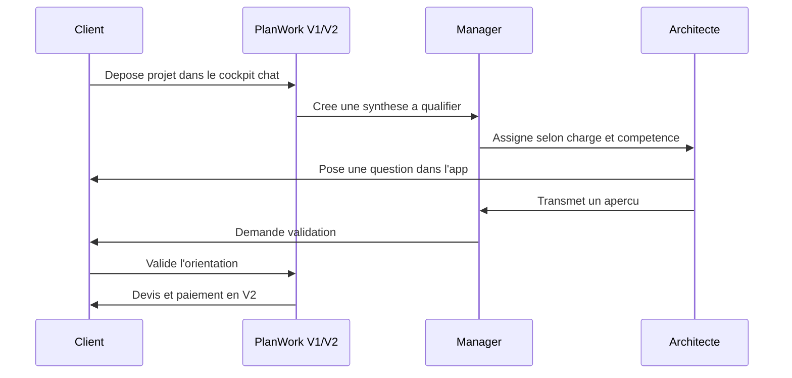
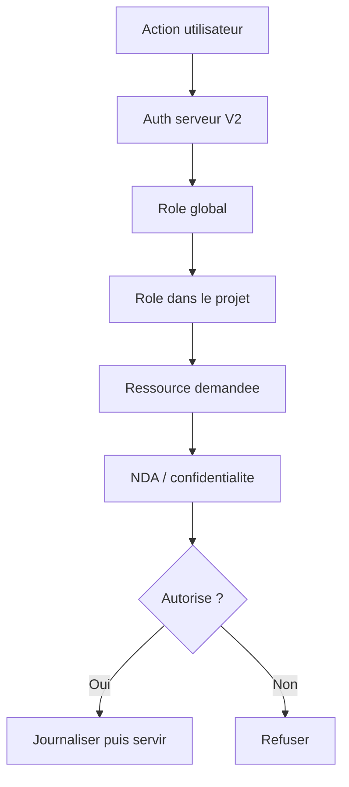

# Workflow

## Cycle de vie projet

```mermaid
stateDiagram-v2
  [*] --> Depot
  Depot --> Qualification
  Qualification --> Assignation
  Assignation --> Production
  Production --> Apercu
  Apercu --> ValidationClient
  ValidationClient --> DevisFutur
  DevisFutur --> LivraisonSecuriseeV2
  ValidationClient --> Corrections
  Corrections --> Production
```

## Sequence cible

```mermaid
sequenceDiagram
  participant C as Client
  participant App as PlanWork V1/V2
  participant M as Manager
  participant A as Architecte
  C->>App: Depose projet dans le cockpit chat
  App->>M: Cree une synthese a qualifier
  M->>A: Assigne selon charge et competence
  A->>C: Pose une question dans l'app
  A->>M: Transmet un apercu
  M->>C: Demande validation
  C->>App: Valide l'orientation
  App->>C: Devis et paiement en V2
```

## Permissions cible

```mermaid
flowchart TD
  Action["Action utilisateur"] --> Auth["Auth serveur V2"]
  Auth --> Role["Role global"]
  Role --> ProjectRole["Role dans le projet"]
  ProjectRole --> Resource["Ressource demandee"]
  Resource --> NDA["NDA / confidentialite"]
  NDA --> Decision{"Autorise ?"}
  Decision -->|Oui| Audit["Journaliser puis servir"]
  Decision -->|Non| Deny["Refuser"]
```
